Class 4 - plotting basics
================
Szymon Drobniak
12/1/24

<div>

> **Before you start…**
>
> Make sure you have the following set and ready:
>
> - Folder you want touse as your working directory exists on your HDD
> - Set this folder as working directory (using a menu or
>   `setwd("YOUR_PATH)`)
> - Relevant data (if provided) is in your working directory

</div>

**In the below instructions…**

**EXERCISE X:** are bits of code to execute/practice pieces to do, often
with only hints on how to perform them.

**Output** indicates the typical output you should expect from a given
instruction.

<div>

> **Data**
>
> We will work on a simple dataset on cholesterol levels from patients.
> The data presents cholesterol concentrations in plasma in patients
> before diet, and after 4 & 8 weeks of diet containing one of two types
> of margarine. The age group of patients is also indicated. Data can be
> downloaded here:
> https://raw.githubusercontent.com/wbabik/Practical_computing/teaching/Class_10/data/Cholesterol_Age_R.csv
>
> ``` r
> data_chol <- read.table("https://raw.githubusercontent.com/wbabik/Practical_computing/teaching/Class_10/data/Cholesterol_Age_R.csv",
>     sep = ";", header = T,
>     stringsAsFactors = T
> )
>
> head(data_chol)
> ```
>
>       ID Before After4weeks After8weeks Margarine AgeGroup
>     1  1   6.42        5.83        5.75         B    Young
>     2  2   6.76        6.20        6.13         A    Young
>     3  3   6.56        5.83        5.71         B    Young
>     4  4   4.80        4.27        4.15         A    Young
>     5  5   8.43        7.71        7.67         B    Young
>     6  6   7.49        7.12        7.05         A   Middle
>
> ``` r
> summary(data_chol)
> ```
>
>            ID            Before       After4weeks     After8weeks    Margarine
>      Min.   : 1.00   Min.   :3.910   Min.   :3.700   Min.   :3.660   A:9      
>      1st Qu.: 5.25   1st Qu.:5.740   1st Qu.:5.175   1st Qu.:5.210   B:9      
>      Median : 9.50   Median :6.500   Median :5.830   Median :5.730            
>      Mean   : 9.50   Mean   :6.408   Mean   :5.842   Mean   :5.779            
>      3rd Qu.:13.75   3rd Qu.:7.218   3rd Qu.:6.730   3rd Qu.:6.688            
>      Max.   :18.00   Max.   :8.430   Max.   :7.710   Max.   :7.670            
>        AgeGroup
>      Middle:6  
>      Old   :7  
>      Young :5  
>                
>                
>                

</div>

## Formula notation

R modelling and graphing functions use a particular type of notation,
originating from the S-PLUS language, to represent relationships between
variables. Proportionality in this notation is indicated by `~`,
left-hand-side (LHS) of the formula contains dependent variables,
right-hand-side (RHS) independent. E.g., `y ~ x + z` may be used to
write down a relationship between a measured `y` variable and two
independent variables (`x` and `z`). Simple formulas (one LHS and one
RHS variable) are covenietnly used to assign variables to axes of a
plot.

## Simple R plot

First…

> *It is a myth that R is incapable of producing a final, publication
> quality (and pretty!) plot that would not have to be modified
> afterwards :)*

To represent data graphically we have to asign it to the proper plot
axis. The simplest way of plotting data in R is by using a built-in
function `plot()`. Variables to plot can be supplied as its arguments,
respectively as **x** (horizontal axis) i **y** (vertical axis) - or by
supplying one argument, a formula, describing the relationship between
the dependent and independent variable, or in other words between x & y
as `y ~ x`. Have a look into `?plot()` to learn more. Note, that -
depending on the situation - you may have to provide just variable names
together with the name of the dataset - using `data = ...` - or to
directly call variables in your dataset (e.g. by using
`...$variable_x`).

**EXERCISE 1:**Try to recreate the below plot using the loaded data.
Consult the `plot()` function if necessary.

**Output**

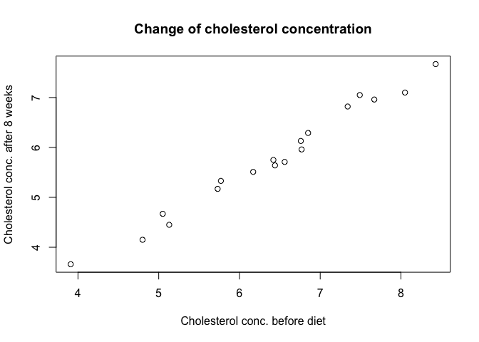

**EXERCISE 2:** Modify the plot changing the shapes and colours used on
the plot (hints can be found here:
<https://www.r-graph-gallery.com/6-graph-parameters-reminder.html>).
Here I’m setting the symbols as blue squares.

**Output**


**EXERCISE 3:** The `plot()` function has the `type` argument - try to
see what this argument does. What happens if we set it to `'n'`?

**Output**

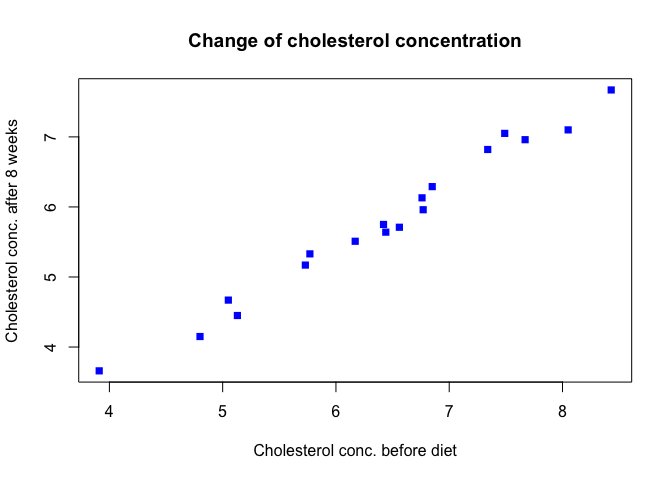


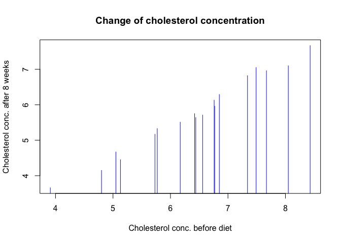

Using the `type = 'l'` leads to a surprising problem - instead of an
expected zig-zag line connecting the points we gat a weird squiggly
bunch of loops. What should be done to the data to retrieve a proper
line plot, like the one below?

**Output**

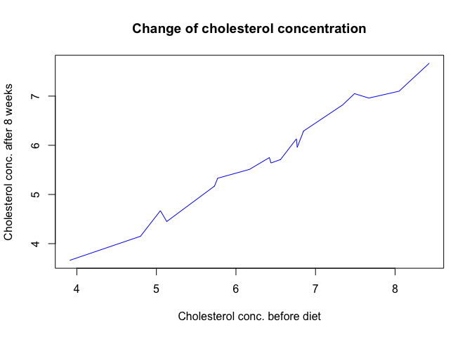

## Using colours in R plots

**EXERCISE 4:** Colours and shapes on a plot can be changed at will. Try
to experiment in order to recreate the below plot. Note: you have to
creat your own data or input it directly into the plotting function.
Information about colour codes can be found here:
<http://derekogle.com/NCGraphing/resources/colors> - in summary, you can
choose them by indicating their names (e.g. `"hotpink"`) or specifying a
colour’s name in a hexadecimal number system (e.g. `"#AA6574"`).

**Output**


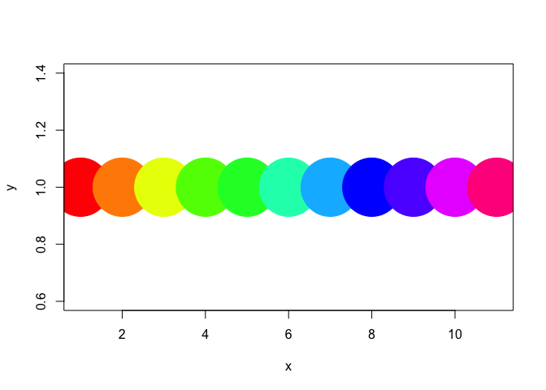

## Assigning colours to variables

Apart from naming the colours directly - we can assign them to
particular values in our data. If data has values directly compatible
with R colours (i.e., integers from 1 to 9), they can be used directly
as colour identifiers.

**EXERCISE 5:** The below plot uses colours to cod the age groups in our
data - try to recreate this plot by linking the `col` option to the
relevant data variable. What key is ues to choose specific colours on
the plot?

**Output**


**EXERCISE 6:** If you would like to use non-default colours here, you
have to use the fact that levels o a categorical variable in R (e.g.,
`AgeGroup`) are coded as integers, and hence can be treated as indices
selecting values from a vector of colour names/codes:

**Output**

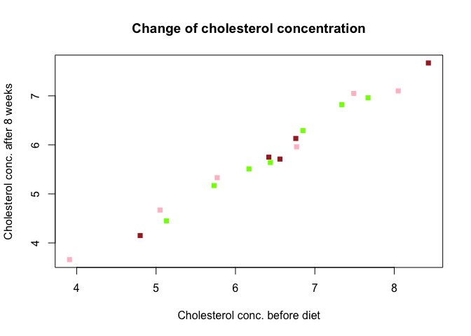

------------------------------------------------------------------------

## Histogram

Histogram is a useful and frequently used type of plot - it can be
generated using the `hist()` function.

**EXERCISE 7:** Create a histogram of 50 ranom samples from a normal
distribution with mean 20 and standard deviation 4 (you may want to use
the following call `rnorm(50, 20, 4)`). **Output**


Histogram does not have one colour parameter - each rectangle has a
border and its filling. Consulting `?hist()` check how to reproduce the
below version of a histogram.

**Output**

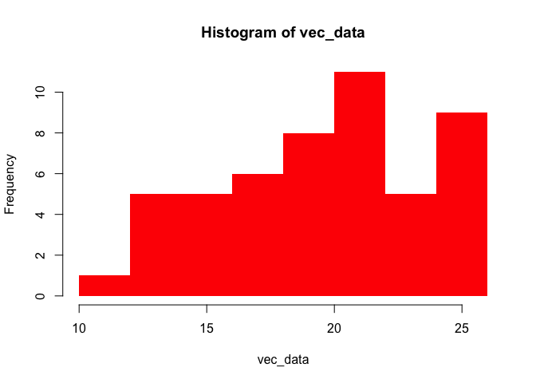

**EXERCISE 8:** Redo the histogram by increasing the number of binning
intervals. **Output** (example)

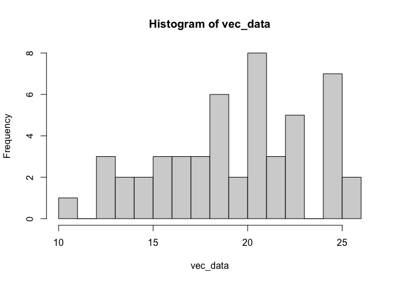

**EXERCISE 9:** instead of a histogram, distributional data can be
presented using a smoothed density of data (*kernel density*). You can
use the built-in function `density()` to produce such curve, and it can
be overlaid on an existing plot using the `lines()` function (similarly,
to the `points()` function overlaying points, the `lines()` function
does not create a new plot but adds lines to an existing plot ). Try to
recreate the above histogram adding to it an overlaid density line:
**Output** (example)


## Setting non-graphical parameters

R plots generated by the basic function can be modified in many ways, to
adjust their appearance to particular needs. A number of parameters can
be set inside the `plot()` function, but others can be set using a
special `par()` function.

**EXERCISE 10:** The plotting area can be modified by setting the limits
of the axes - to achieve this modify the `ylim` and `xlim` arguments,
they take vectors of length 2 as values. **Output**

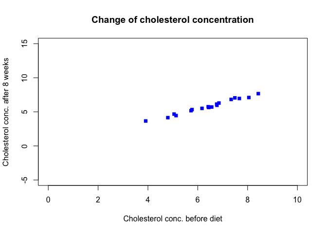

Such option becomes especially useful when plotting custom curves, that
need to be displayed in some speciic range. Compare the two below plots:

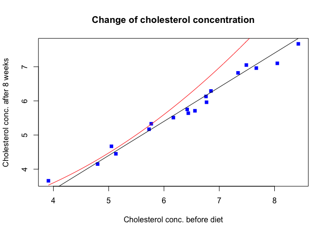

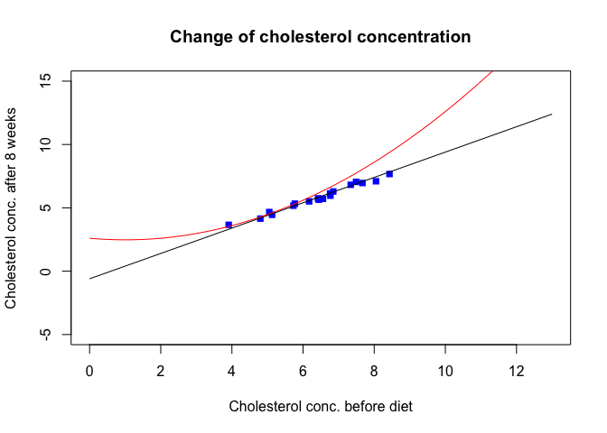

**EXERCISE 11:** Try applying similar modification to our final
histogram, to avoid automativ selection of x-axis ends (which slightly
misses the limits o actual data).

**Output** (example)


**EXERCISE 12:** The plotting function options can also be used to
change the type of axes to logged - we can achieve this in two ways,
resulting in two different ways of presentation. The simplest is to use
the `log` option in the `plot()` function: **Output**


However, you can also directly log the data while plotting it (how would
you achieve this?). **Output**

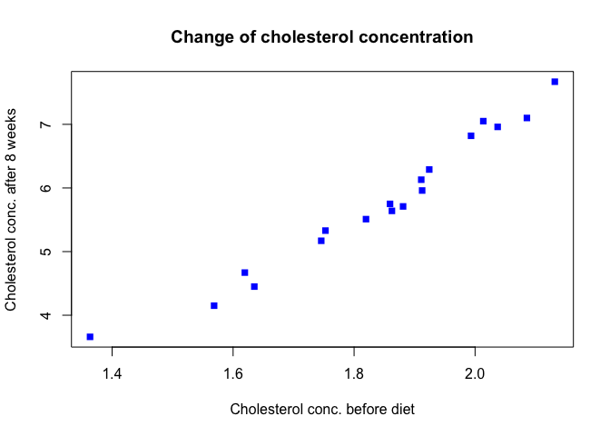

The plots look similar - but there is one fundamental difference - what
is it? What type of log was used in these plots?

**EXERCISE 13:** In order to modify plot parameters such as its
margins - we have to use the `par()` function, and we should modify
specific parameters in it. Be aware, that the setting chosen will affect
any future plot produced in a given session of R. Try using the `mai`
option (which specifies distances in inches) or `mar` option (which
specify distances in lines of text) to change the plot margins (each of
these options takes a vector with 4 elements, the margins of bottom,
left, top and right edge). The below picture demonstrates how the margin
parameters are interpreted with respect to a plotting area:

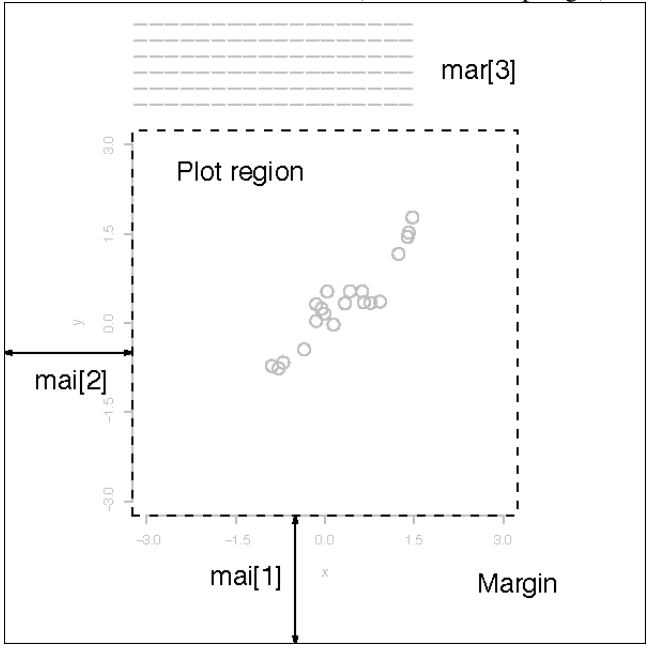

**Output**

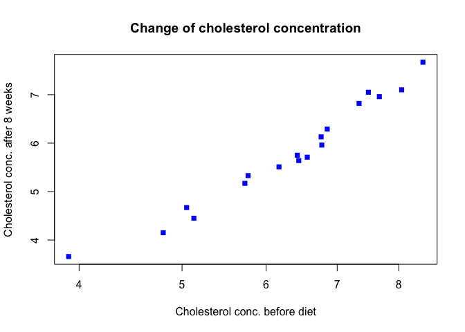

If at any stage you use the `par()` function and loose track of what
parameters have been modified and which haven’t (or - another function
happens to modify some graphical parameters beyond your control) you can
easily reset the plotting standard output to the default graphical
parameters. Just run:

``` r
dev.off()
```

which will close and reset the active (screen) plotting output.

## Using `ggplot2` - introduction

Control over the graphical parameters in the `plot()` function is
rudimentary. The **ggplot2** package gives much more control over how
the plots are made and built. The **ggplot2** package is based on so
called graphics grammar, a set of rules describing the visual appearance
of a plot:

- linking of data to specific elements of a plot (so called **mapping**)
  is separated from its actual appearance (i.e., **aesthetics**);
- the plot has a layered structure, with latter elements appearing on
  top of the former ones;
- if possible all plot elements should be built on the go, inside of the
  plotting code, without the need of modifying/transforming the original
  data.

A simple *ggplot2* graph may be structured as follows:

``` r
mygraph <- ggplot(data = MYDATA,
                  mapping = aes(x = VAR1, y = VAR2, ...)) +
  geom_1(OPTIONS) +
  geom_2(OPTIONS)

plot(mygraph)

graph2 <- mygraph + geom_3
plot(graph2)
```

Calling the `ggplot()` function may be used only to create an object of
class `ggplot`, without displaying the actual graph. Such object will
contain the data and its mappings to specific elements of the final
plot. To display it, we need additional function from the `geom_...`
family, which add specific visual elements to the defined mappings
(e.g. `geom_point` adds scatterpoints, `geom_hist` forms a histogram).
Subsequent elements can be concatenated using the `+` operator. other
elements that can be added to the plot using `+` are display and
aesthetic rules, e.g. `theme()`, which describe the appearance of
non-data elements of a plot.

Load the `ggplot2` - if you don’t have it use `install.packages()` to
install it.

``` r
# install.packages('ggplot2')
library(ggplot2)
```

## `ggplot2` scatterplot

**EXERCISE 14:** Make a scatterplot similar to one of the previous
excersises, mapping the concentrations of cholesterol on the x and y
axes. Use blue squares as points. You may want to use the `cex` option
to increase the default symbol size (`cex` defines a multiplicative
coefficient, that increases or decreases plot elements given number of
times).

**Output**


