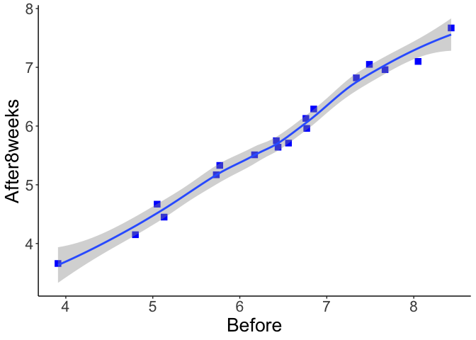
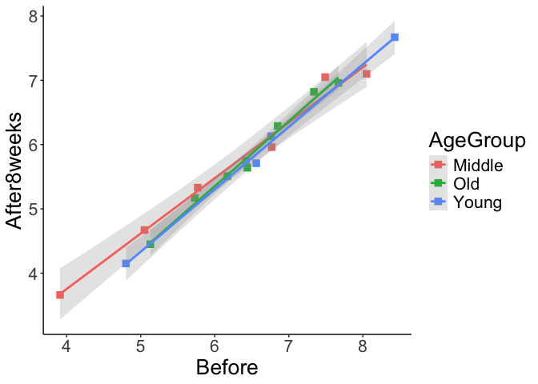
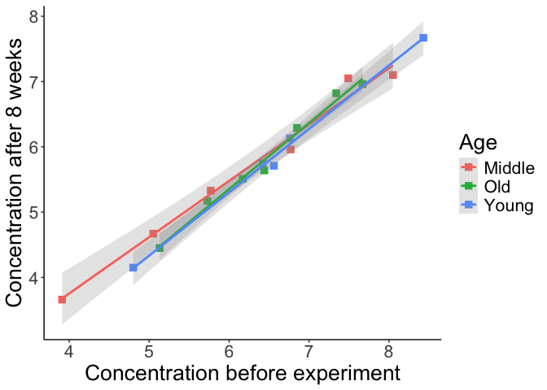
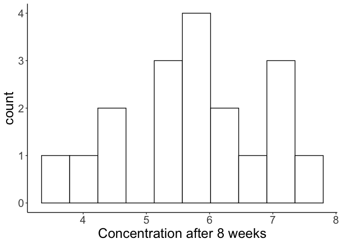
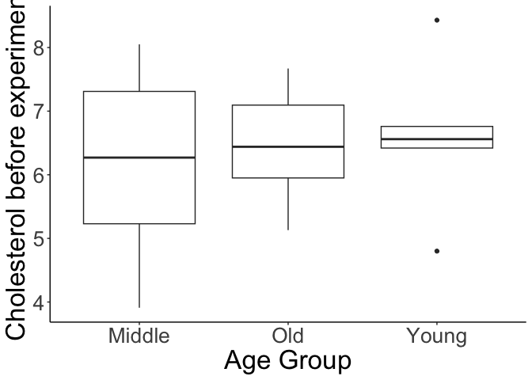

Class 5 - plotting using `ggplot2`; programming; overview of statistics
================
Szymon Drobniak
12/8/24

<div>

> **Before you start…**
>
> Make sure you have the following set and ready:
>
> - Folder you want touse as your working directory exists on your HDD
> - Set this folder as working directory (using a menu or
>   `setwd("YOUR_PATH)`)
> - Relevant data (if provided) is in your working directory

</div>

**In the below instructions…**

**EXERCISE X:** are bits of code to execute/practice pieces to do, often
with only hints on how to perform them.

**Output** indicates the typical output you should expect from a given
instruction.

<div>

> **Data**
>
> We will work on a simple dataset on cholesterol levels from patients.
> The data presents cholesterol concentrations in plasma in patients
> before diet, and after 4 & 8 weeks of diet containing one of two types
> of margarine. The age group of patients is also indicated. Data can be
> downloaded here:
> https://raw.githubusercontent.com/wbabik/Practical_computing/teaching/Class_10/data/Cholesterol_Age_R.csv
>
> ``` r
> data_chol <- read.table("https://raw.githubusercontent.com/wbabik/Practical_computing/teaching/Class_10/data/Cholesterol_Age_R.csv",
>     sep = ";", header = T,
>     stringsAsFactors = T
> )
>
> head(data_chol)
> ```
>
>       ID Before After4weeks After8weeks Margarine AgeGroup
>     1  1   6.42        5.83        5.75         B    Young
>     2  2   6.76        6.20        6.13         A    Young
>     3  3   6.56        5.83        5.71         B    Young
>     4  4   4.80        4.27        4.15         A    Young
>     5  5   8.43        7.71        7.67         B    Young
>     6  6   7.49        7.12        7.05         A   Middle
>
> ``` r
> summary(data_chol)
> ```
>
>            ID            Before       After4weeks     After8weeks    Margarine
>      Min.   : 1.00   Min.   :3.910   Min.   :3.700   Min.   :3.660   A:9      
>      1st Qu.: 5.25   1st Qu.:5.740   1st Qu.:5.175   1st Qu.:5.210   B:9      
>      Median : 9.50   Median :6.500   Median :5.830   Median :5.730            
>      Mean   : 9.50   Mean   :6.408   Mean   :5.842   Mean   :5.779            
>      3rd Qu.:13.75   3rd Qu.:7.218   3rd Qu.:6.730   3rd Qu.:6.688            
>      Max.   :18.00   Max.   :8.430   Max.   :7.710   Max.   :7.670            
>        AgeGroup
>      Middle:6  
>      Old   :7  
>      Young :5  
>                
>                
>                

</div>

## `ggplot2`

### Scatterplot

``` r
library(ggplot2)
```

**EXERCISE 1:** Make a scatterplot similar to one of the previous
excersises, mapping the concentrations of cholesterol on the x and y
axes. Use blue squares as points. You may want to use the `cex` option
to increase the default symbol size (`cex` defines a multiplicative
coefficient, that increases or decreases plot elements given number of
times).

**Output**


**EXERCISE 2:** Let’s improve the plot by removing the annoying gray
background. add the `theme_...()` call to the plot (you can review
different predefined versions of it here
<https://ggplot2.tidyverse.org/reference/ggtheme.html>) to produce a
cleaner graph. **Output**


**EXERCISE 3:** An even more aesthetically-pleasing plot can be produced
using the “classic” theme. Try also, by addind the `theme()` definition
to the plot, to modify the `text` element using the following
formatting: `element_text(size = 20)` - which should increase the
default font sizing). **Output**


**EXERCISE 4:** Add the `geom_smooth` aesthetic to the plot, selecting
the `lm` method as its option. Do you know what does `lm` indicate?
**Output**


**EXERCISE 5:** We can modify the above call to change the appearance of
the regression line. **Output**



### Annotating the plot, other dimensions of data

**EXERCISE 6:** Try to map the age groups (`AgeGroup`) to the graph
points’ colours. Using the `alpha` option (taking values 0 - 1 - which
indicates the transparency of the regression error band) I decreased the
cluttered appearance of the plot, making the error bands a bit more
subtle. **Output**



**EXERCISE 7:** let’s add the `labs()` layer with a bit more readable
axes names. **Output**



### `ggplot2` histogram

**EXERCISE 8:** Using the `geom_hist()` geometry create a histogram of
the `After8weeks` variable. **Output**



**EXERCISE 9:** Change the histogram so that it displays relative
frequencies of data in each bin, and not absolute counts. Inspiration on
how to do this can be found here:
<https://homepage.divms.uiowa.edu/~luke/classes/STAT4580/histdens.html> -
there are at least two ways of achieving this goal!

**Output**


### Boxplot

**EXERCISE 10:** `geom_boxplot()` can be used to visualise categorical
data. In base R this is achieved by using the `boxplot()` function:


Try to produce such plot, showing the cholesterol concentrations before
the diet, categorised by age groups, in `ggplot2`. Use `?geom_boxplot`
and if needed the book <https://ggplot2-book.org/collective-geoms.html>
to find out how to achieve this. On such a boxplot - what is the meaning
of: the boundaries of each box, the ends of the whiskers and the
additional points added to the plot?

**Output**



### Customizing plot elements - scales, axes, legends

In our previous example we used in all cases default colours supplied by
`ggplot`. Let’s explore the ways we can modify legends. First - produce
the below plot based on the \`Diet_R.csv’ data, it shows the
relationship between body height and post-diet weight in three different
diet groups. You can load the data here:

``` r
mydata <- na.omit(read.table("https://raw.githubusercontent.com/wbabik/Practical_computing/teaching/Class_10/data/Diet_R.csv", sep = ",", header = T))
```

``` r
myplot <- ggplot(data = mydata, mapping = aes(x = Height, y = weight6weeks, colour = as.factor(Diet))) +
  geom_point() +
  geom_smooth(method = "lm") +
  theme_classic() +
  theme(text = element_text(size = 20)) +
  labs(x = "Height", y = "Weight after 6 weeks", colour = "Diet type", title = "Height vs. weight")
myplot
```


**EXERCISE 11:** Let’s try to build a box-plot using this dataset, the
gender should be used linked to a colour of boxes on the plot, the diet
types shoud appear on the x-axis, and the weight after 6 weeks should be
the response variable.

**Output**


To make the plot a bit more comprehensive, we can modify scales linked
to colour, fill and, for example, x axis. Use `scale_colour_viridis_d()`
(a discrete version of the viridis palette), `scale_fill_viridis_d` and
`scale_x_discrete` to modify the above plot and reproduce the below
example. Note: if you don;t have the `viridis` library installed,
execute first `install.packages('viridis')`.

``` r
myplot <- ggplot(data = mydata, mapping = aes(x = as.factor(Diet),
                                            color = as.factor(gender),
                                            y = weight6weeks,
                                            fill = as.factor(gender))) +
  geom_boxplot(alpha = 0.3, outlier.shape = NA) + 
  labs(x = "Diet type", y = "Weight after diet", colour = "Gender", fill = "Gender") +
  scale_colour_viridis_d(labels = c('female', 'male')) +
  scale_fill_viridis_d(labels = c('female', 'male')) +
  scale_x_discrete(labels = c('vegan', 'lacto-ovo', 'vegeterian')) +
  theme_classic() +
  theme(text = element_text(size = 20))
myplot
```


## Elements of programming in R

<div>

> **Code execution and flow control**
>
> In R, you can use very similar programming constructions as in other
> programming languages. For example, to execute certain parts of your
> code conditionally, you can use the `if ... else ...` syntax:
>
>     if (condition) {
>       # code to execute if condition is TRUE
>     } else {
>       # code to execute if condition is FALSE
>     }
>
> On the other hand, you can use the `for` loop to iterate over a
> sequence of elements:
>
>     for (i in 1:10) {
>       print(i)
>     }

</div>

The below code shows you a simple example of binding these two command
together. In it, we print even-numbered elements of the built-in letter
vector `LETTERS` for letters from 4th until 17th, using the conditional
and loop statements:

``` r
for (i in 4:17) {
  if (i %% 2 == 0) {
    print(LETTERS[i])
  }
}
```

    [1] "D"
    [1] "F"
    [1] "H"
    [1] "J"
    [1] "L"
    [1] "N"
    [1] "P"

In this excersie you will take advantage of these two ways of
controlling the flow of your code. We will use an old method to estimate
the value of $\pi$ - the Monte Carlo method. The idea is to randomly
select points in a square with dimensions 1x1, and then check how many
of them fall into a circle with radius 0.5 (or diameter 1). The ratio of
points in the circle to all points in the square should be close to
$\pi/4$. The reason for this is that the area of the circle is
$\pi r^2$, and the area of the square is $(2r)^2 = 4r^2$. The ratio of
the areas is $\pi/4$.

**EXERCISE 12:** Write a piece of code the executes this method. Use the
`runif()` function to generate random numbers between 0 and 1. Execute
the method for 500, 1000 and 10000 iterations - does it improve the
estimate of the estimated value of $\pi$? Remember, that to checking if
points fall into a circle of a given radius, you can use the Pythagorean
theorem: $x^2 + y^2 < r^2$.

**Output**

``` r
N <- 1000
inside <- 0
all <- 0

for (i in 1:N) {
  x <- runif(1)
  y <- runif(1)
  if (x^2 + y^2 < 1) {
    inside <- inside + 1
  }
  all <- all + 1
}

pi_est <- 4 * inside / all
pi_est
```

    [1] 3.12

If you are curious how to perform this method without using the loop and
conditional instructions, check out the code below.

## Overview of statistics

### Descriptive statistics

**EXERCISE 13:** Calculate the mean and standard deviation of the
`After8weeks` variable in the `data_chol` dataset. Use the `mean()` and
`sd()` functions to do this.

**Output**

    [1] 5.778889

    [1] 1.101912

### Hypothesis testing

**EXERCISE 14:** Perform a t-test to check if the mean cholesterol
concentration after 8 weeks of diet is different between the two types
of margarine. Use the `t.test()` function to do this. Note: you can - as
always - specify the dependent and independent variables using the
formula `y ~ x` notation.

**Output**


        Welch Two Sample t-test

    data:  After8weeks by Margarine
    t = -1.1253, df = 13.508, p-value = 0.2801
    alternative hypothesis: true difference in means between group A and group B is not equal to 0
    95 percent confidence interval:
     -1.6892688  0.5292688
    sample estimates:
    mean in group A mean in group B 
           5.488889        6.068889 

### Regression

**EXERCISE 15:** Perform a linear regression to check if the cholesterol
concentration after 8 weeks of diet can be predicted by the
concentration before the diet. Use the `lm()` function to do this.

**Output**


    Call:
    lm(formula = After8weeks ~ Before, data = data_chol)

    Residuals:
         Min       1Q   Median       3Q      Max 
    -0.20843 -0.15401  0.01823  0.12825  0.27904 

    Coefficients:
                Estimate Std. Error t value Pr(>|t|)    
    (Intercept) -0.09513    0.20283  -0.469    0.645    
    Before       0.91670    0.03115  29.428 2.32e-15 ***
    ---
    Signif. codes:  0 '***' 0.001 '**' 0.01 '*' 0.05 '.' 0.1 ' ' 1

    Residual standard error: 0.153 on 16 degrees of freedom
    Multiple R-squared:  0.9819,    Adjusted R-squared:  0.9807 
    F-statistic:   866 on 1 and 16 DF,  p-value: 2.321e-15

## Appendix - more advanced `ggplot2`

**EXERCISE A:** An alternative way of coding age gropups - instead of
mapping it to colours - may be splitting the groups by so called
*facets*, which presents subsets of data on separate subplots using a
common scale. To achieve this you should use the `facet_wrap()`
function, which takes a formula of the form `~ A`, where A indicates a
variable from the dataset that defines the split of the graph area into
subplots. (An analogous function `facet_grid()` handles well two-sided
formulas `A ~ B` that define a grid of plots). Try to recreate the below
plot - it may look better with the `theme_bw()` style, instead of the
“classic’ one. **Output**

``` r
plot1 <- ggplot(data = data_chol, mapping = aes(x = Before, y = After8weeks, color = AgeGroup)) +
  facet_wrap( ~ AgeGroup) +
  geom_point(shape = 15, cex = 3) + theme_bw() + geom_smooth(method = 'lm') +
  labs(x = "Concentration before experiment", y = "Concentration after 8 weeks", color = "Age") +
  theme(text = element_text(size = 20))
plot1
```


**EXERCISE B:** Modify the histogram to add a kernel density estimator
to it (it is an analogue of the `density()` function we have used
earlier).

**Output**

``` r
### This is the second way of turning counts to frequencies in a ggplot2 histogram
plot1 <- ggplot(data = data_chol, mapping = aes(x = Before, y = ..density..)) +
  geom_histogram(fill = 'white', color = 'black', bins = 10) +
  geom_density(color = 'red', fill = 'red', alpha = 0.15) +
  labs(x = "Concentration after 8 weeks") + theme_classic() +
  theme(text = element_text(size = 20))
plot1
```


### Grid of plots

If our goal is to place multiple unrelated plots on one figure - we may
as well use the `ggpubr` package and its `ggarrange()` function.

``` r
# install.packages('ggpubr') # if needed
library(ggpubr)
```

**EXERCISE C:** First - produce 4 plots and save them to 4 differently
named objects. These can be some of the plots we have generated so far:

``` r
plot1 <- ggplot(data = data_chol, mapping = aes(x = Before, y = After8weeks)) +
  geom_point(color = 'blue', shape = 15, cex = 3) + theme_classic() +
  theme(text = element_text(size = 12))

plot2 <- ggplot(data = data_chol, mapping = aes(x = Before, y = ..density..)) +
  geom_histogram(fill = 'white', color = 'black', bins = 10) +
  geom_density(color = 'red', fill = 'red', alpha = 0.15) +
  theme_classic() +
  theme(text = element_text(size = 12))

plot3 <- ggplot(data = data_chol, mapping = aes(x = Before, y = After4weeks, color = AgeGroup)) +
  geom_point(shape = 15, cex = 3) + theme_classic() + geom_smooth(method = 'lm', alpha = 0.25) +
  theme(text = element_text(size = 12))

plot4 <- ggplot(data = data_chol, mapping = aes(x = After4weeks, y = After8weeks, color = AgeGroup)) +
  geom_point(shape = 15, cex = 3) + theme_classic() + geom_smooth(method = 'lm', alpha = 0.25) +
  theme(text = element_text(size = 12))
```

Now - produce a grid plot from the four subplots using the `ggarrange()`
function. Label the subplots as `A`, `B`, `C`, `D`.

``` r
gridplot <- ggarrange(plot1, plot2, plot3, plot4,
                      labels = c('A', 'B', 'C', 'D'), legend = 'bottom', common.legend = T)
gridplot
```


### Box-plots continued

**EXERCISE D:** a boxplot may be more informative if we add raw data to
it. It can be done in many ways - e.g., to achieve an effect similar to
this one: <https://bit.ly/31estrN>. Try to produce a similar plot using
additional data (file `Diet_R.csv`, which presents weight loss of
patients on three different diets). Before using the data clean it from
all missing values (`na.omit()`). Data can be found here:
https://raw.githubusercontent.com/wbabik/Practical_computing/teaching/Class_10/data/Diet_R.csv

``` r
mydata <- na.omit(read.table("https://raw.githubusercontent.com/wbabik/Practical_computing/teaching/Class_10/data/Diet_R.csv", sep = ",", header = T))
```

To achieve the below effect remember to include the following
components: use `geom_boxplot()` and `geom_point()` to map data to
visuals; map genders to box colours; for both points and boxes you can
set `alpha` option to something \<1 to ensure that they are a bit
teansparent and hence less tiring to our eyes.

**Output**

``` r
plot3 <- ggplot(data = mydata, mapping = aes(x = as.factor(Diet),
                                            color = as.factor(gender),
                                            y = weight6weeks,
                                            fill = as.factor(gender))) +
  geom_boxplot(alpha = 0.3, outlier.shape = NA) + 
  theme_classic() +
  geom_point(color = "black",
             position = position_jitterdodge(jitter.width = 0.1),
             size = 3, alpha = 0.5, stroke = 0) +
  theme(text = element_text(size = 25)) +
  labs(x = "Diet type", y = "Weight after 6 weeks",
       color = "Gender", fill = "Gender")

plot3
```


**EXERCISE E:** add anothe layer to the plot - using the
`scale_colour_manual()` component change colours used on the plot to
purple, organe and dark grey for diets 1, 2 and 3. In order to achieve
this you should assign these colours to `values` of the scale.

**Output**

``` r
myplot <- ggplot(data = mydata, mapping = aes(x = Height, y = weight6weeks, colour = as.factor(Diet))) +
  geom_point() +
  geom_smooth(method = "lm") +
  theme_classic() +
  theme(text = element_text(size = 20)) +
  labs(x = "Height", y = "Weight after 6 weeks", colour = "Diet type", title = "Height vs. weight") +
  scale_colour_manual(values = c('purple', 'orange', 'darkgrey'))
myplot
```


**EXERCISE F:** to give some more space for the width of the plot move
the legend (by modifying the `theme()` function call) to the bottom of
the plot.

**Output**

``` r
myplot <- ggplot(data = mydata, mapping = aes(x = Height, y = weight6weeks, colour = as.factor(Diet))) +
  geom_point() +
  geom_smooth(method = "lm") +
  theme_classic() +
  theme(text = element_text(size = 20), legend.position = "bottom") +
  labs(x = "Height", y = "Weight after 6 weeks", colour = "Diet type", title = "Height vs. weight") +
  scale_colour_manual(values = c('purple', 'orange', 'darkgrey'))
myplot
```


**EXERCISE G:** by specifying `guide = "none"` in the scale layer, you
can remove the legend altogether - try it.

**Output**

``` r
myplot <- ggplot(data = mydata, mapping = aes(x = Height, y = weight6weeks, colour = as.factor(Diet))) +
  geom_point() +
  geom_smooth(method = "lm") +
  theme_classic() +
  theme(text = element_text(size = 20)) +
  labs(x = "Height", y = "Weight after 6 weeks", colour = "Diet type", title = "Height vs. weight") +
  scale_colour_manual(values = c('purple', 'orange', 'darkgrey'), guide = "none")
myplot
```


**EXERCISE H:** by using the `labels` option in the scale layer you can
easily rename the categories presented in the lgend. Try renaming them
to vegan (diet 1), lacto-ovo (diet 2) and vegetarian (diet 3).

**Output**

``` r
myplot <- ggplot(data = mydata, mapping = aes(x = Height, y = weight6weeks, colour = as.factor(Diet))) +
  geom_point() +
  geom_smooth(method = "lm") +
  theme_classic() +
  theme(text = element_text(size = 20), legend.position = "bottom") +
  labs(x = "Height", y = "Weight after 6 weeks", colour = "Diet type", title = "Height vs. weight") +
  scale_colour_manual(values = c('purple', 'orange', 'darkgrey'),
                      labels = c('vegan', 'lacto-ovo', 'vegetarian'))
myplot
```


**EXERCISE I:** similarly to using the `xlim`/`ylim` options in the
`plot()` function, you can modify the plotting area of a `ggplot` graph.
There are two way to achieve this. The first involves adding the
`xlim()` (check `?xlim` for details) or `ylim()` layers (or both). The
other works by modifying the coordinate system used and adding the
layer: `coord_cartesian(xlim = c(...))`. Which produces which plot
below? How do they differ in handling the plotted data?

**Output**

``` r
myplot <- ggplot(data = mydata, mapping = aes(x = Height, y = weight6weeks, colour = as.factor(Diet))) +
  geom_point() +
  geom_smooth(method = "lm") +
  theme_classic() +
  theme(text = element_text(size = 20), legend.position = "bottom") +
  labs(x = "Height", y = "Weight after 6 weeks", colour = "Diet type", title = "Height vs. weight") +
  scale_colour_manual(values = c('purple', 'orange', 'darkgrey'),
                      labels = c('vegan', 'lacto-ovo', 'vegetarian')) +
  xlim(c(160, 175))
myplot
```


``` r
myplot <- ggplot(data = mydata, mapping = aes(x = Height, y = weight6weeks, colour = as.factor(Diet))) +
  geom_point() +
  geom_smooth(method = "lm") +
  theme_classic() +
  theme(text = element_text(size = 20), legend.position = "bottom") +
  labs(x = "Height", y = "Weight after 6 weeks", colour = "Diet type", title = "Height vs. weight") +
  scale_colour_manual(values = c('purple', 'orange', 'darkgrey'),
                      labels = c('vegan', 'lacto-ovo', 'vegetarian')) +
  coord_cartesian(xlim = c(160, 175))
myplot
```


### Barplot

``` r
myplot <- ggplot(data = mydata, mapping = aes(x = as.factor(Diet),
                                            fill = as.factor(gender),
                                            y = ..count..)) +
  geom_bar() + 
  labs(x = "Diet type", y = "Count", fill = "Diet") +
  scale_x_discrete(labels = c('vegan','lacto-ovo', 'vegeterian')) +
  scale_fill_discrete(labels = c('f', 'm')) +
  theme_classic() +
  theme(text = element_text(size = 20))

# ggplot2 automatically counts things (..count.. is optional)

myplot
```


``` r
myplot <- ggplot(data = mydata, mapping = aes(x = as.factor(Diet),
                                            fill = as.factor(gender),
                                            y = ..count..)) +
  geom_bar(position = "dodge") + 
  labs(x = "Diet type", y = "Count", fill = "Diet") +
  scale_x_discrete(labels = c('vegan','lacto-ovo', 'vegeterian')) +
  scale_fill_discrete(labels = c('f', 'm')) +
  theme_classic() +
  theme(text = element_text(size = 20))

# ggplot2 automatically counts things (..count.. is optional)

myplot
```


### Error bars

``` r
library(tidyverse)

summ <- tibble(Age = levels(data_chol$AgeGroup),
               mean = by(data_chol$After8weeks, data_chol$AgeGroup, mean, na.rm = T),
               se = by(data_chol$After8weeks, data_chol$AgeGroup,
                       function(x) sd(x, na.rm = T)/sqrt(length(x))))

myplot <- ggplot(data = summ, mapping = aes(x = Age, y = mean,
                                            ymin = mean-se, ymax = mean+se)) +
  geom_bar(stat = 'identity', fill = 'white', colour = 'black') +
  geom_errorbar(width = 0.5) +
  theme_classic() +
  theme(text = element_text(size = 20)) +
  labs(y = "Cholesterol conc. after 8 weeks") +
  scale_x_discrete(limits = c('Young', 'Middle', 'Old'))
myplot
```


``` r
myplot <- ggplot(data = summ, mapping = aes(x = Age, y = mean,
                                            ymin = mean-se, ymax = mean+se)) +
  geom_point(colour = 'black', cex = 5) +
  geom_errorbar(width = 0.5) +
  theme_classic() +
  theme(text = element_text(size = 20)) +
  labs(y = "Cholesterol conc. after 8 weeks") +
  scale_x_discrete(limits = c('Young', 'Middle', 'Old'))
myplot
```


``` r
myplot <- ggplot(data = summ, mapping = aes(x = Age, y = mean,
                                            ymin = mean-se, ymax = mean+se)) +
  geom_point(colour = 'black', cex = 5) +
  geom_errorbar(width = 0.5) +
  theme_classic() +
  theme(text = element_text(size = 20)) +
  labs(y = "Cholesterol conc. after 8 weeks") +
  scale_x_discrete(limits = c('Young', 'Middle', 'Old')) +
  ylim(c(0, 6.5))
myplot
```


### Saving the plots

Use the `ggsave` function - it provides some powerful plot saving
routines.

**EXERCISE J:** Save one of the last plots to a JPG file and to a PDF
file. Rescale the pdf to about 80% of the original plot size. Check
`?ggsave` for more information. Compare what happens when you save the
plot to a PDF file directly from the plotting console.
